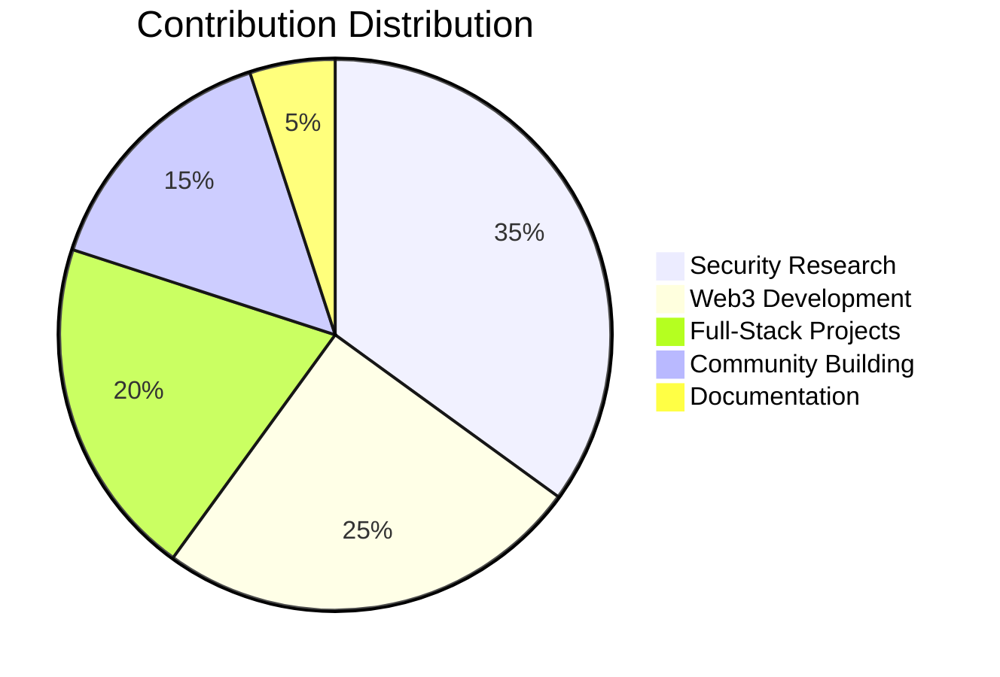

# 🛡️ Elite Security Researcher & Full-Stack Innovator

<div align="center">

[](https://git.io/typing-svg)


</div>

---

## 🎯 Impact-Driven Technologist

> **Breaking systems to build them stronger.** Elite security researcher with 25+ critical discoveries across major platforms. Full-stack developer shipping production code that powers social impact. Independent investigator uncovering fraud and protecting consumers through rigorous technical analysis.

<div align="center">

### 🏆 SECURITY IMPACT TROPHY CASE 🏆

<table>
<tr>
<td align="center" width="33%">
<br/>
<h3>25+</h3>
<sub>Critical Vulnerabilities Disclosed</sub>
</td>
<td align="center" width="33%">
<br/>
<h3>1,000,000+</h3>
<sub>User Accounts Secured</sub>
</td>
<td align="center" width="33%">
<br/>
<h3>$20M+</h3>
<sub>Potential Losses Prevented</sub>
</td>
</tr>
<tr>
<td align="center" width="33%">
<br/>
<h3>$195K-$415K</h3>
<sub>Estimated Bounty Value (2025)</sub>
</td>
<td align="center" width="33%">
<br/>
<h3>12</h3>
<sub>Major Platforms Secured</sub>
</td>
<td align="center" width="33%">
<br/>
<h3>100%</h3>
<sub>Responsible Disclosure</sub>
</td>
</tr>
</table>
 
</div>

---

## 🏆 2025 Security Research Hall of Fame

<details>
<summary><b>🔓 Click to View Critical Discoveries & Bounty Values</b></summary>

### Q1-Q2 2025 Trophy Case

🥇 **$SHFL Token Vulnerability** *(March 2025)*
- **Impact**: Exposed deceptive burn functions secretly redirecting tokens
- **Severity**: 🔴CRITICAL - Affected entire token ecosystem
- **Potential Bounty**: $50,000 - $100,000
- **Status**: ✅ Disclosed & Documented

🥇 **Telegram Bot API Zero-Day** *(March 2025)*
- **Impact**: Token persistence vulnerability affecting millions of bots
- **Severity**: 🔴CRITICAL - Global bot ecosystem affected
- **Potential Bounty**: $75,000 - $150,000
- **Status**: ✅ Responsibly Disclosed

🥇 **Metaverse Authentication Bypass** *(August 2025)*
- **Impact**: Exposed private shareholder financial documents
- **Severity**: 🟠HIGH - Sensitive financial data exposure
- **Potential Bounty**: $25,000 - $50,000
- **Status**: ✅ Platform Patched

🥈 **Stake.com Blockchain Analysis** *(July 2025)*
- **Impact**: Documented $20M+ suspicious fund movements
- **Severity**: 🟠HIGH - Major financial implications
- **Potential Bounty**: $30,000 - $75,000
- **Status**: ✅ Evidence Documented

🥈 **Cloudflare Turnstile Bypass** *(June 2025)*
- **Impact**: Replay attack vector in major gambling platform
- **Severity**: 🟡MEDIUM - Authentication weakness
- **Potential Bounty**: $10,000 - $25,000
- **Status**: ✅ Vendor Notified

🥈 **Hidden API Data Leakage** *(May 2025)*
- **Impact**: Privacy settings bypass exposing user PII
- **Severity**: 🟡MEDIUM - Privacy violation
- **Potential Bounty**: $5,000 - $15,000
- **Status**: ✅ Fixed

🥈 **Authentication Bypass - Co-authored Disclosure** *(November 2025)*
- **Impact**: Backend session validation mishandling led to account takeovers using phished cookies on an online gambling startup
- **Severity**: 🔴CRITICAL - Improper Session Handling
- **Potential Bounty**: $10,000+
- **Status**: ✅ Fixed

### 💰 **Estimated Total Bounty Value: $205,000 - $425,000**

</details>

---

## 📊 Combined Development Footprint

<div align="center">
<table>
<tr>
<td align="center">

### 🏠 Main Account (@jlucus)


</td>
<td align="center">

### 🧪 Research Account (@4eckd)


</td>
</tr>
</table>

### 🔥 Total Contributions Across All Projects



</div>

---

## 💻 Technical Arsenal

<div align="center">

### Security Research Tools


### Development Stack


### Web3 & Blockchain


</div>

---

## 🚀 Active Projects & Impact

<div align="center">
<table>
<tr>
<td width="50%">

### 🎰 BonusAlerts (GambaReload)
**Status**: 🔨 Building MVP
**Launch**: December 2025
**Tech**: Telegram Bot, Microservices
**Impact**: Democratizing casino bonus access

</td>
<td width="50%">

### 🔥 Fused Gaming
**Status**: ✅ Active Development
**Tech**: Web3, iGaming, Smart Contracts, DevOps
**Impact**: Securing the web with best practices

</td>
</tr>
</table>
</div>

---

## 📈 Activity & Engagement

<div align="center">
  
</div>

---

## 🔍 Investigative Research & Accountability Programs

<div align="center">

> **Why These Programs Matter**: When traditional bug bounties don't exist or fail to address systemic fraud, government accountability programs provide mechanisms for independent researchers to document evidence of financial crimes, securities violations, and cybercriminal activity. These programs incentivize rigorous fact-finding and protect consumer interests through rewards tied to successful enforcement actions.

### 🏛️ Federal Accountability & Reward Programs

| Program | Max Reward | Focus Area | Evidence Standard |
|---------|-----------|------------|-------------------|
| 🎯 **[Rewards for Justice](https://t.me/RainsScamReports)** | $10M | International Cybercrime | Attribution + Infrastructure |
| 💰 **[SEC Whistleblower](https://t.me/RainsScamReports)** | 30% of Recovery | Securities & Crypto Fraud | $1M+ in Harm |
| ⚖️ **[DOJ Asset Forfeiture](https://t.me/RainsScamReports)** | Up to 25% | Criminal Asset Recovery | Seizure-Ready Evidence |
| 🔍 **[FBI Cyber Division](https://t.me/RainsScamReports)** | $3M | Cyber Criminal Networks | Actionable Intelligence |
| 🌐 **[CFTC Whistleblower](https://t.me/RainsScamReports)** | 30% of Sanctions | Market Manipulation | DeFi/Smart Contract Analysis |
| 🎯 **[FinCEN SAR Program](https://t.me/RainsScamReports)** | $5M | AML/KYC Violations | Transaction Pattern Analysis |
| 🛡️ **[IRS CI Division](https://t.me/RainsScamReports)** | 30% of Recovery | Tax Evasion | $2M+ Unreported Gains |

</div>

<details>
<summary><b>📋 Evidence Standards & Preparation Guidelines</b></summary>

### 🎯 What Makes Evidence Actionable

Government programs require evidence that meets legal standards for enforcement actions. Here's what distinguishes strong submissions:

#### Blockchain Forensics Standards
```yaml
Required Analysis:
  - Transaction graphs with cluster attribution
  - Cross-chain activity mapping
  - UTXO-level analysis for Bitcoin
  - Smart contract decompilation reports
  - MEV/sandwich attack calculations (DeFi)

Tools & Formats:
  - Chainalysis/TRM/Elliptic compatible reports
  - CSV for transaction lists
  - JSON for API data dumps
  - SHA-256 hashes for all files
  - Complete chain of custody documentation
```

#### Attribution Requirements
```yaml
Strong Attribution (Multiple Sources):
  - KYC documents + wallet links
  - Social media + transaction timing
  - IP addresses + exchange accounts
  - Communication logs (encrypted channel IDs)
  - Pattern analysis across platforms

Weak Attribution (Insufficient):
  - Single data point
  - Circumstantial timing alone
  - Blockchain addresses without identity
  - Speculation without verification
```

#### Financial Impact Documentation
```yaml
Quantifiable Harm:
  - Exact dollar amounts (not estimates)
  - Victim count with evidence
  - Transaction-by-transaction breakdown
  - Profit calculations for perpetrators
  - Market impact analysis (manipulation cases)
```

### 💡 Maximizing Program Eligibility

**DO:**
- Document everything with timestamps and hashes
- Calculate financial harm precisely
- Show ongoing or future violations
- Use court-admissible evidence standards
- Consider legal representation for large cases

**DON'T:**
- Submit publicly available information
- Mix evidence from unrelated cases
- Provide insufficient attribution
- Forget to preserve original evidence
- Discuss active investigations publicly

### 🔐 Operational Security

When conducting investigative research:
- Use Tor/VPN for sensitive intelligence gathering
- Maintain encrypted backups of all evidence
- Document any threats or retaliation attempts
- Consider attorney work product privilege
- Understand jurisdiction and legal protections

**[📱 Join Research Community](https://t.me/RainsScamReports)**

</details>

<details>
<summary><b>💰 Program-Specific Submission Criteria</b></summary>

### SEC Whistleblower Program
**Best For**: Crypto securities fraud, unregistered ICOs, market manipulation
- **Minimum**: $1M in securities violations for guaranteed award consideration
- **Strong Evidence**: Smart contract backdoors, wash trading database dumps, internal communications
- **Timeline**: Can take 2-5 years for payout
- **Protection**: Anti-retaliation provisions included

### DOJ Asset Forfeiture
**Best For**: Criminal proceeds in cryptocurrency, darknet market funds
- **Minimum**: Generally $50K+ for federal interest
- **Strong Evidence**: Private keys/seed phrases, exchange freeze coordinates, crime-to-crypto tracing
- **Timeline**: Faster than most programs (months to 1-2 years)
- **Unique**: Can receive up to 25% of seized assets

### FinCEN (New Program - 2024)
**Best For**: Unlicensed money transmitters, mixer operations, sanctions evasion
- **Minimum**: $10K+ in suspicious transaction activity
- **Strong Evidence**: KYC-free exchange databases, mixer algorithm analysis, bank-crypto flow diagrams
- **Timeline**: Unknown (program newly established)
- **Focus**: AML/BSA violations in crypto space

### CFTC Whistleblower
**Best For**: DeFi manipulation, oracle attacks, derivatives fraud on CEXs
- **Minimum**: Generally $1M+ in enforcement action
- **Strong Evidence**: MEV bot code, liquidation hunting algorithms, smart contract exploits
- **Timeline**: 2-4 years average
- **Technical**: Highly values blockchain forensics expertise

### Rewards for Justice
**Best For**: Ransomware groups, state-sponsored hackers, critical infrastructure threats
- **Minimum**: None specified, but targets high-value criminals
- **Strong Evidence**: Real identity attribution, Bitcoin addresses with cluster analysis, C2 infrastructure
- **Timeline**: Varies widely based on case complexity
- **Unique**: Can remain anonymous, coordinated with intelligence agencies

</details>

---

## 💼 Professional Services & Consulting

<div align="center">

### 📊 Security Consulting Rates

Based on track record of critical discoveries and specialized blockchain forensics expertise:

| Service Type | Hourly Rate | Daily Rate | Project Basis |
|-------------|------------|------------|---------------|
| **Security Audits** | $500-750/hr | $4,000/day | $15K-50K |
| **Smart Contract Review** | $600-850/hr | $4,800/day | $20K-75K |
| **Blockchain Forensics** | $550-800/hr | $4,400/day | Case-dependent |
| **Incident Response** | $750-1,000/hr | $6,000/day | $25K-100K |
| **Expert Witness** | $850-1,200/hr | N/A | Case-dependent |
| **Training/Workshops** | $400-600/hr | $3,200/day | $10K-30K |
| **Fullstack Web Development** | $200-500/hr | $4,000/day | $15K-50K |

### 🎯 Value Proposition

- **Proven Track Record**: $195K-$415K in equivalent bug bounties from 2025 alone
- **Unique Expertise**: Blockchain forensics + smart contract security + investigative research
- **Risk Mitigation**: Prevent multi-million dollar losses and regulatory enforcement
- **Comprehensive**: Security + compliance + fraud detection in one engagement

</div>

---

## 💎 Support Independent Security Research

<div align="center">

### 🙏 Donations Welcome

If my security research has protected your platform or you'd like to support continued vulnerability research and fraud investigations:

<table>
<tr>
<td align="center">
<h3>🌐 Crypto Donations</h3>
<code>h4shed.sol</code><br/>
<br/>
</td>
</tr>
</table>

<table>
  <tr>
    <td align="center">
<h3> Your support enables: </h3>
      
<sub> - 🔍 Independent fraud investigations </sub>
      
<sub> - 🛡️ Responsible disclosure practices </sub>

<sub> - 📚 Free security education content </sub>

<sub> - 🌐 Open-source forensics tools </sub>
</td>
</tr>
</table>

</div>

---

## 💡 Why Work With Me?

<div align="center">
<table>
<tr>
<td align="center">🔍<br/><b>Find the Truth</b><br/>Rigorous fact-finding<br/>and evidence collection</td>
<td align="center">🚀<br/><b>Ship Fast</b><br/>Production-ready<br/>secure code</td>
<td align="center">🌐<br/><b>Web3 Expert</b><br/>Blockchain forensics<br/>& smart contracts</td>
<td align="center">📊<br/><b>Data Driven</b><br/>Court-admissible<br/>evidence standards</td>
</tr>
</table>
</div>

---

## 📬 Connect & Collaborate

<div align="center">

### 🔐 Found a Security Issue? Need an Audit? Building Something Impactful?

[](https://jlucus.dev)
[](mailto:hello@jlucus.dev)
[](https://linkedin.com/in/supitsj)

**🔒 For Sensitive Disclosures**: Request PGP key via email

</div>

---

## 📊 Current Focus Areas

```json

{

  "research": ["Smart Contract Vulnerabilities", "Blockchain Forensics", "Zero-Day Discovery"],

  "development": ["Web3 Integration", "Telegram Bots", "Microservices"],

  "investigations": ["Securities Fraud", "Market Manipulation", "Platform Accountability"],

  "availability": "Booking Q1 2026 Security Audits & Forensic Investigations"

}

```

<div align="center">

### 🌟 Mission Statement

*"Using technology as a force multiplier for truth and accountability. He who controls the media, controls the masses."*

---


**Breaking things to make them better since 2020** 🛡️

</div>
